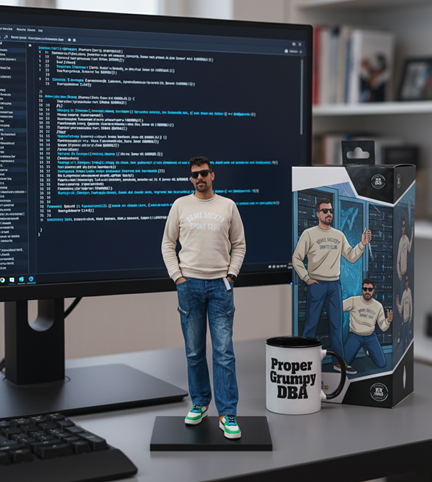

# Database Reliability Engineering (DBRE)

### Hi there 👋, I'm Sérgio

  

I am a Database Reliability Engineer (DBRE) passionate about designing, building, and maintaining scalable, reliable, and performant data infrastructure. This repository serves as a collection of my projects, scripts, and notes related to database engineering and reliability.

### About Me

I specialize in bridging the gap between traditional database administration and modern DevOps/SRE practices. My focus is on automating database operations, improving system observability, and ensuring data integrity and availability for critical applications.

* 🔭 I’m currently working on migrating SQL Servers into AWS EC2 AMIs using [dbtools](https://dbatools.io/)
* 🌱 I’m currently learning PostgreSQL in depth
* 👯 I’m looking to collaborate on DBRE projects that brings new tech knowledge into my already vast repertoire.
* 🤔 I’m looking for help with anything that you see can be improved in whatever I do (and trust me...there's a lot to improve!)
* 💬 Ask me about anything, I'll answer... eventually.
* 📫 How to reach me: [LinkedIn](www.linkedin.com/in/sergioagoncalves)

### Core Competencies

Here are some of the key areas I specialize in and the technologies I work with:

**Cloud & On-Premise Databases:**

* **Relational:** SQL Server, PostgreSQL, MySQL
* **NoSQL:** MongoDB, DynamoDB, DocumentDB
* **Cloud Native:** Amazon Aurora/RDS, Redshift, Azure SQL Database, Google Cloud SQL

**Infrastructure & Automation:**

* **IaC:** Terraform
* **Containerization:** Docker, Kubernetes
* **CI/CD:** Octopus, Jenkins, GitLab CI, GitHub Actions

**Observability & Monitoring:**

* **Monitoring:** Grafana, Datadog
* **Logging:** ELK Stack (Elasticsearch, Logstash, Kibana), Splunk
* **Alerting:** PagerDuty

**Programming & Scripting:**

* **Languages:** Python, PowerShell, Bash

**Reliability & Performance:**

* Performance Tuning & Optimization
* High Availability (HA) & Disaster Recovery (DR) Planning
* Backup and Recovery Strategies
* Database Security & Compliance

### Featured Projects

Here are a few highlights from my work. You can find more in the repositories tab.

| Project Name  | Description                                                              | Technologies Used                     | Link                                            |
| ------------- | ------------------------------------------------------------------------ | ------------------------------------- | ----------------------------------------------- |
| **Database Deploys** | This project aims to automate database deploys end to end.    | `Octopus`, `Flyway`, `GitHub Actions`, `PowerShell`, `Python`   | [Link to Repo](https://github.com/BoiDareia/DBRE/blob/main/octopus-deploys/src/octopus-deploy) |
| **RedShift Maintenance** | This project accomplishes the daily maintenance (vacuuming and analyzing) for Redshift.    | `Octopus`, `Python`    | [Link to Repo](https://github.com/BoiDareia/DBRE/blob/main/octopus-deploys/scripts/python/redshift-daily-maintenance.md) |
| **Sql Fluff Linting** | This impacts the way we manage our code by applying rules directly into Git.    | `GitHub Actions`, `SQL Fluff`     | [Link to Repo](https://github.com/BoiDareia/DBRE/blob/main/octopus-deploys/.github/workflows/sql-code-linting.md) |

### My Philosophy on Database Reliability

I believe in a proactive, automation-first approach to database management. My goal is to build self-healing, resilient systems that can withstand failures with minimal human intervention. I adhere to SRE principles by defining SLOs/SLIs, managing error budgets, and focusing on toil reduction.

### Let's Connect!

I'm always open to discussing new opportunities, interesting projects, or just chatting about data and reliability. Feel free to reach out!

* **[LinkedIn](www.linkedin.com/in/sergioagoncalves)**

## ⚠️ Acknowledgements and Disclaimer

This repository is my personal collection of useful scripts and tools accumulated throughout my career as a DBRE. Many of these solutions are not my original work but have been sourced from community forums, blogs, and colleagues.

I have made an effort to provide attribution to the original author directly within the code files where possible. If you see your work in this repository without proper credit, please open an issue to let me know or contact me directly, and I will be happy to add the appropriate acknowledgement.